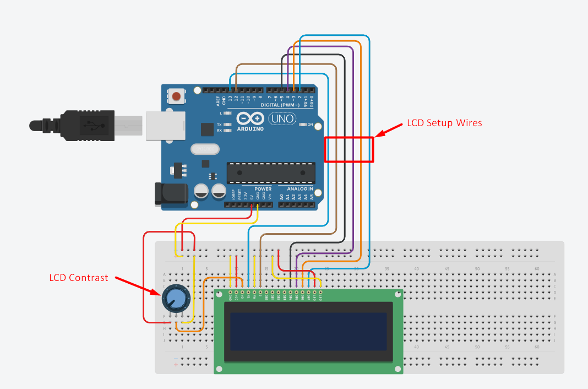

# LCD Platformer Game 🕹️

A simple 2D platformer game built using an Arduino Uno and a 20x4 character LCD display. Navigate through levels using a joystick and avoid deadly spikes!

---

## 📸 Project Preview



---

## 🔧 Features

- Uses a 20x4 LCD as the game screen
- Character jumping and movement mechanics
- Level progression and collision detection
- Custom characters (player, walls, obstacles)

---

## 🛠️ Hardware Requirements

| Component         | Quantity |
|------------------|----------|
| Arduino Uno      | 1        |
| 20x4 LCD Display | 1        |
| Joystick Module  | 1        |
| Breadboard & Jumper Wires | loads |

---

## 📦 Wiring Overview

### LCD Display Pins:
- **RS** → Digital Pin 12  
- **EN** → Digital Pin 11  
- **D4** → Digital Pin 5  
- **D5** → Digital Pin 4  
- **D6** → Digital Pin 3  
- **D7** → Digital Pin 2  

### Input Pins:
- **Joystick X-axis** → Analog Pin A2  
- **Joystick Button** → Digital Pin 8

---

## 🎮 How to Play

1. Power up the Arduino.
2. Use the **joystick left/right** to move the player.
3. Press the **joystick button** to jump.
4. Reach the right edge of each level to progress.
5. Touching a spike (`*`) resets you to the first level.

---

## 📁 File Structure

```bash
/Ardu-LCD-Platformer/
│
├── platformer.ino
├── README.md
└── circuit.png
